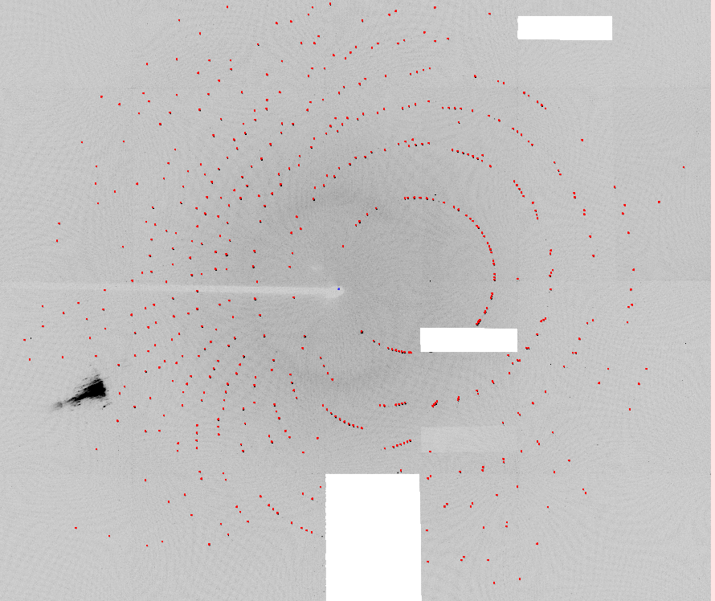
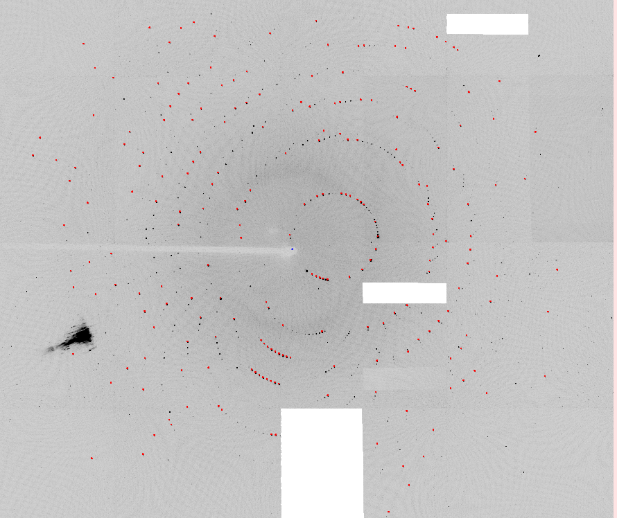
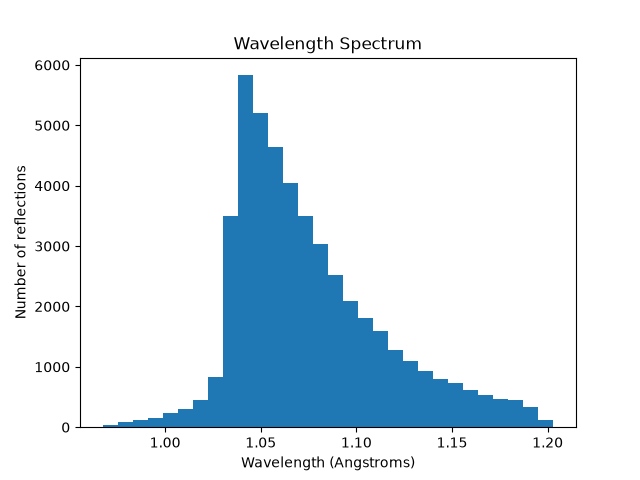
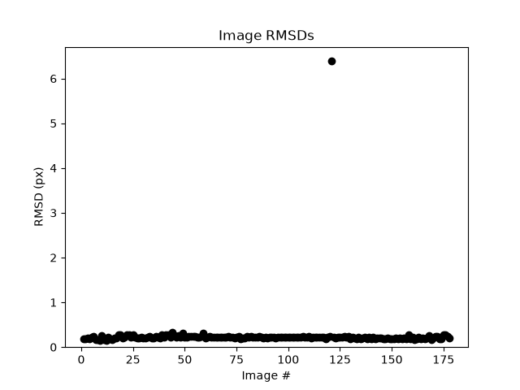
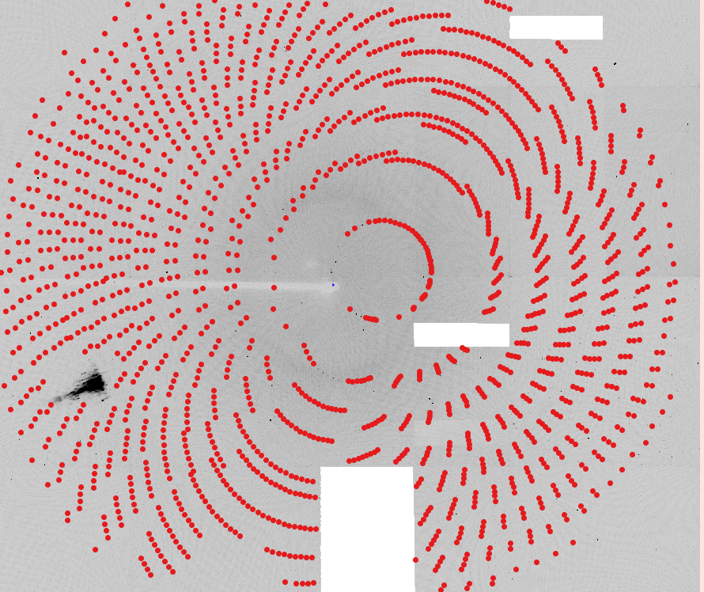
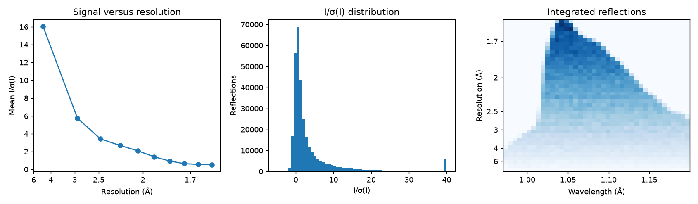

Serial Pink-Beam Laue Processing of DHFR Data
=============================================

This tutorial walks through processing polychromatic (“pink-beam”)
diffraction images as **serial stills** with ``laue-dials``. In serial
crystallography every image comes from a different crystal, or from the
same crystal at an unknown orientation, so nothing can be assumed about
how one image relates to the next. Each image is therefore indexed on
its own with the pink-beam indexer built into DIALS (``pinkIndexer``),
and only then handed to the polychromatic ``laue-dials`` pipeline for
wavelength assignment, geometry refinement, prediction, and integration.

The data set is the *E. coli* dihydrofolate reductase (DHFR) Laue data
set that ships with the ``laue-dials`` examples. It was recorded on a
Rayonix MX340-HS detector with a 200 mm crystal-to-detector distance and
a spectrum peaking near 1.04 Å. The images were actually collected as a
rotation series with one degree between frames, but here we deliberately
**ignore the goniometer** and treat every frame as an independent still.
That makes this data set a convenient stand-in for a true serial
experiment: it exercises exactly the same code path, while still
allowing you to check the results against the rotation-series tutorial
if you wish.

This tutorial processes the **complete** 179-image data set. At the end
of processing we will have an integrated ``.mtz`` file that can be
scaled and merged with
```careless`` <https://github.com/rs-station/careless>`__.

Installation
============

The easiest way to install ``laue-dials`` and its dependencies is using
`Anaconda <https://docs.anaconda.com/free/anaconda/install/index.html>`__
(or its lighter-weight cousins Miniforge/Micromamba). First update
``conda`` and install the libmamba solver, which makes environment
creation much faster:

::

    conda update -n base conda
    conda install -n base conda-libmamba-solver
    conda config --set solver libmamba

Then create and activate an environment for the install:

::

    conda create --name laue-dials
    conda activate laue-dials

Now install the main dependency, `DIALS <https://dials.github.io>`__,
and then ``laue-dials`` itself with ``pip``:

::

    conda install -c conda-forge dials
    pip install laue-dials

All other dependencies (including ``reciprocalspaceship``, which writes
the final ``.mtz`` file) are installed automatically. Reopen this
notebook with the environment activated when you are ready.

Documentation for ``laue-dials`` can be found
`here <https://rs-station.github.io/laue-dials/index.html>`__, and
entering any ``laue.*`` command with no arguments on the command line
prints a help page. This tutorial was run with DIALS 3.29 and laue-dials
0.5.1.

Introduction
============

The DHFR data set is available on
`Zenodo <https://zenodo.org/records/10199220>`__. It contains 179 MCCD
images named ``e080_001.mccd`` through ``e080_179.mccd``, plus a
``pixels.mask`` file that blanks out the beamstop shadow and a few dead
regions of the detector.

This tutorial processes all 179 images. Every program in the pipeline
below takes an ``nproc`` (or ``N``) argument to parallelize across
images, and nothing in the pipeline depends on how many images you give
it, so the same commands work unchanged on a subset or on a much larger
collection.

Copy (or symlink) all of the images into a directory called ``data``
next to this notebook, and put ``pixels.mask`` in the working directory:

::

    data/e080_001.mccd
    data/e080_002.mccd
    ...
    data/e080_179.mccd
    pixels.mask

All of the commands in this tutorial are also collected in
:download:`serial_pipeline.sh <serial_pipeline.sh>`, which you can run in
one go once you are comfortable with the individual steps. We use
``N=12`` throughout; adjust it to match the number of cores available on
your machine.

Importing Data
==============

``dials.import`` reads the images and their headers and writes an
experiment list (``imported.expt``) describing the beam, detector, and
(for rotation data) goniometer and scan. For MCCD images from this
beamline the header does not contain everything DIALS needs, so we
supply the missing pieces on the command line:

-  ``geometry.beam.wavelength=1.04`` — the peak wavelength of the
   spectrum. This is a placeholder used by the monochromatic algorithms;
   the polychromatic steps will assign a wavelength to every reflection
   individually.
-  ``geometry.detector.panel.pixel=0.08854,0.08854`` — the pixel size in
   mm.
-  ``geometry.scan.oscillation=0,1`` and
   ``geometry.goniometer.axes=0,1,0`` — a nominal scan and rotation
   axis, needed only so that the format reader is happy. They are
   discarded in the next line.
-  ``convert_sequences_to_stills=True`` — this is the key option for
   serial data. It tells DIALS to forget the scan and goniometer and to
   treat every image as an independent still experiment, which is what
   we want for a serial data set.
-  ``lookup.mask=pixels.mask`` — the pixel mask. Applying it at import
   means it is stored in the experiment list and inherited by every
   later step.

.. code:: bash

    dials.import geometry.scan.oscillation=0,1 \
        geometry.goniometer.axes=0,1,0 \
        convert_sequences_to_stills=True \
        geometry.beam.wavelength=1.04 \
        geometry.detector.panel.pixel=0.08854,0.08854 \
        lookup.mask=pixels.mask \
        input.template=$(pwd)/data/e080_###.mccd

The import summary at the end of the output should report
``num stills: 179`` and no sweeps. If you see a sweep instead,
``convert_sequences_to_stills`` did not take effect and the later
stills-specific options will fail.

A quick way to check that the geometry is sensible is ``dials.show``:

.. code:: bash

    dials.show imported.expt | head -n 40

Spot Finding
============

Spot finding is exactly the same as for rotation data: we look for
connected pixels that rise above the local background on every image. We
call ``laue.find_spots``, a thin wrapper around ``dials.find_spots``
(either can be used interchangeably). The important parameters are:

-  ``spotfinder.threshold.dispersion.gain=0.15`` — the effective
   detector gain used by the dispersion threshold. Lower values find
   more (and weaker) spots; too low and you start picking up noise. For
   this detector 0.15 gives a clean set of strong spots.
-  ``spotfinder.filter.max_separation=10`` — the maximum distance in
   pixels between a spot’s centroid and its brightest pixel. This
   rejects streaky or overlapping blobs that would confuse indexing.
-  ``output.shoeboxes=False`` — do not store the pixel data for every
   spot in the reflection file. It keeps ``strong.refl`` small; the
   integrator does its own pixel extraction later.
-  ``lookup.mask=pixels.mask`` — the mask again, so masked pixels never
   become spots.

``N`` sets the number of parallel processes. Raise it on a machine with
more cores and memory.

.. code:: bash

    N=12
    
    laue.find_spots imported.expt \
        output.shoeboxes=False \
        spotfinder.mp.nproc=$N \
        spotfinder.threshold.dispersion.gain=0.15 \
        spotfinder.filter.max_separation=10 \
        lookup.mask=pixels.mask

The log ends with a histogram of spots per image. Across the 179 images,
each yields between roughly 390 and 610 strong spots, for 85,428 in
total, and the counts are consistent from image to image, which is a
good sign that the threshold is neither too high nor too low.

Viewing Images
--------------

The best way to judge spot finding is to look at the spots on the raw
image. DIALS ships an interactive viewer for this:

::

    dials.image_viewer imported.expt strong.refl

“Mark centers of mass” is ticked by default and draws the found spots as
red dots. If many obvious spots are not marked, lower the gain; if the
marks land on noise between the spots, raise it. The viewer also has a
tool for drawing new mask regions if you see scatter from the beamstop
or a bad panel that you want to exclude. We also pass ``brightness=60``
(equivalent to raising the “Brightness” slider in the settings panel) to
make the faint diffuse scatter around the streaks easier to see.

The screenshot below is exactly what ``dials.image_viewer`` shows for
the first image once spot finding has run — no extra plotting code
required.

.. code:: bash

    dials.image_viewer imported.expt strong.refl brightness=60



   Spot finding results on the first image

The spots lie on the curved, streak-like loci typical of Laue
diffraction: each streak is a row of reflections from one
reciprocal-lattice line, spread out along the streak by the range of
wavelengths in the beam. The masked beamstop arm and the dead rectangles
show up as blank regions with no spots.

Indexing Each Still with pinkIndexer
====================================

Indexing is where serial data differ most from rotation data. With a
rotation series ``laue.index`` can use the known one-degree steps
between images to index every frame with a single crystal model. In a
serial experiment each image must be indexed on its own, and because the
beam is polychromatic we cannot use the usual monochromatic stills
indexers either: a reflection’s position on the detector no longer
determines its reciprocal-lattice vector until we know its wavelength.

DIALS includes the **pinkIndexer** algorithm (`Gevorkov et al.,
2020 <https://doi.org/10.1107/S2053273319015559>`__) for exactly this
situation. Given the unit cell and an approximate wavelength range, it
searches for the crystal orientation that places the most observed spots
on lattice points *for some wavelength inside the bandwidth*. It is
selected in ``laue.index`` with
``indexer.indexing.method=pink_indexer``.

``laue.index`` wraps ``dials.index``; every ``dials.index`` parameter is
available under the ``indexer.`` prefix. The command below is long, so
here is what each group of parameters does:

**Pink indexer parameters** (``indexer.indexing.pink_indexer.*``)

-  ``wavelength=1.1`` and ``percent_bandwidth=15`` define the wavelength
   window the indexer considers: 1.1 Å ± 7.5 %, i.e. roughly 1.02–1.18
   Å. The window should cover the bulk of your spectrum. Note that it
   need not be centred on the placeholder wavelength given to
   ``dials.import``.
-  ``max_refls=50`` — index using the 50 strongest spots on each image.
   More spots make the orientation search slower without much benefit.
-  ``rotogram_grid_points=360`` and ``voxel_grid_points=250`` control
   how finely orientation space is sampled. Finer grids give more
   precise starting orientations but need proportionally more memory per
   process (360 rotogram points needs a few GB per process on this data
   set) — raise ``N`` and this grid together only as far as your
   machine’s memory allows.
-  ``min_lattices=20`` — ask the indexer to generate up to 20 candidate
   lattices per image rather than stopping at the first few, so the
   stills indexer has more alternatives to choose between before picking
   a winner. In recent DIALS versions this option is deprecated in
   favour of ``target_lattices``, which works the same way. Together, a
   fine rotogram grid and a generous lattice budget are what make
   pinkIndexer reliable on this data set: with a coarser grid (180
   points) and fewer candidates (5) we found a noticeably larger
   fraction of images converged to the wrong lattice, visible later as
   outliers in the per-image RMSD after refinement.

**Known symmetry** (``indexer.indexing.known_symmetry.*``)

-  The space group (19, *P*\ 2₁2₁2₁) and unit cell of DHFR. pinkIndexer
   requires a unit cell; it cannot determine one *ab initio*. If your
   cell is only approximately known, increase ``percent_bandwidth``,
   which also absorbs uncertainty in the cell lengths.

**Stills indexing parameters** (``indexer.indexing.stills.*`` and
friends)

-  ``refinement_protocol.mode=None`` — do not refine the crystal model
   inside ``dials.index``. Monochromatic refinement of polychromatic
   data would pull the model towards a compromise wavelength; we leave
   refinement to the polychromatic steps below.
-  ``stills.refine_all_candidates=True``, ``stills.rmsd_min_px=20``, and
   ``stills.ewald_proximal_volume_max=0.03`` — every candidate lattice
   is scored with a quick stills refinement and the best one is kept.
   The thresholds are generous because, under the single-wavelength
   assumption, most reflections will *not* sit exactly on the Ewald
   sphere.
-  ``joint_indexing=False`` — index every image independently. This is
   what makes the run “serial”: no information is shared between images.
-  ``refinement.reflections.outlier.algorithm=None``,
   ``parameterisation.auto_reduction.action=fix``, and
   ``parameterisation.scan_varying=False`` — settings for the candidate
   refinement that avoid rejecting reflections or failing on stills with
   few spots.

**Output**

-  ``laue_output.index_only=True`` — skip the scan-varying refinement
   that ``laue.index`` normally runs after indexing. That refinement is
   meaningful only for rotation data. The indexed stills are written
   directly to ``monochromatic.expt`` and ``monochromatic.refl``.

.. code:: bash

    N=12
    
    laue.index imported.expt strong.refl \
        indexer.indexing.nproc=$N \
        indexer.indexing.method="pink_indexer" \
        indexer.indexing.pink_indexer.wavelength=1.1 \
        indexer.indexing.pink_indexer.percent_bandwidth=15 \
        indexer.indexing.pink_indexer.max_refls=50 \
        indexer.indexing.pink_indexer.min_lattices=20 \
        indexer.indexing.pink_indexer.rotogram_grid_points=360 \
        indexer.indexing.pink_indexer.voxel_grid_points=250 \
        indexer.indexing.known_symmetry.space_group=19 \
        indexer.indexing.known_symmetry.unit_cell=34.297,45.552,99.035,90,90,90 \
        indexer.indexing.refinement_protocol.mode=None \
        indexer.indexing.stills.ewald_proximal_volume_max=0.03 \
        indexer.indexing.stills.rmsd_min_px=20 \
        indexer.indexing.stills.refine_all_candidates=True \
        indexer.indexing.joint_indexing=False \
        indexer.refinement.reflections.outlier.algorithm=None \
        indexer.refinement.parameterisation.auto_reduction.action=fix \
        indexer.refinement.parameterisation.scan_varying=False \
        laue_output.index_only=True

The log is long because the stills indexer reports a refinement for
every candidate lattice on every image. Look for the
``Indexing imageset id`` banners to follow progress from image to image,
and for ``n_indexed`` in the summary after each one. Indexing all 179
images with ``N=12`` took about seven minutes on the machine this
tutorial was run on.

Let us look at what came out. ``monochromatic.expt`` now contains 179
crystal models, one per image, and ``monochromatic.refl`` has the strong
spots with Miller indices assigned where the indexer could do so.

.. code:: python

    import numpy as np
    from dials.array_family import flex
    from dxtbx.model.experiment_list import ExperimentListFactory
    
    mono_expts = ExperimentListFactory.from_json_file("monochromatic.expt", check_format=False)
    mono = flex.reflection_table.from_file("monochromatic.refl")
    strong = flex.reflection_table.from_file("strong.refl")
    
    n = len(mono_expts)
    per_strong = np.array([(strong["id"] == i).count(True) for i in range(n)])
    per_indexed = np.array([(mono["id"] == i).count(True) for i in range(n)])
    fractions = per_indexed / per_strong
    
    cells_arr = np.array([e.crystal.get_unit_cell().parameters() for e in mono_expts])
    
    print(f"Images indexed: {n}")
    print(f"Strong spots: {per_strong.sum()}; indexed (monochromatic): {per_indexed.sum()}")
    print(f"Fraction indexed: mean {fractions.mean():.2f}, "
          f"range {fractions.min():.2f}-{fractions.max():.2f}")
    print("Mean unit cell (monochromatic): "
          + ", ".join(f"{v:.2f}" for v in cells_arr.mean(axis=0)))
    print("Unit cell std dev: "
          + ", ".join(f"{v:.2f}" for v in cells_arr.std(axis=0)))

+-------------------------+---------------------------------+
| metric                  | value                           |
+=========================+=================================+
| images indexed          | 179                             |
+-------------------------+---------------------------------+
| strong spots            | 85,428                          |
+-------------------------+---------------------------------+
| indexed (monochromatic) | 32,817                          |
+-------------------------+---------------------------------+
| fraction indexed, mean  | 0.38                            |
+-------------------------+---------------------------------+
| fraction indexed, range | 0.12 – 0.51                     |
+-------------------------+---------------------------------+
| mean unit cell (Å)      | a = 34.19, b = 45.38, c = 98.96 |
+-------------------------+---------------------------------+
| unit cell std dev (Å)   | a = 0.08, b = 0.19, c = 0.28    |
+-------------------------+---------------------------------+

Two things stand out, and both are expected:

1. **Only about 38 % of the strong spots are indexed on average**
   (ranging from 12 % to 51 % image-to-image). The stills indexer still
   assigns Miller indices using a single wavelength (1.04 Å), and only
   reflections whose true wavelength happens to be close to it satisfy
   the Ewald condition within the tolerance. The remaining spots are
   real, and ``laue.optimize_indexing`` will recover most of them in the
   next section.
2. **The unit cells are slightly off and scattered.** Cell lengths from
   a monochromatic treatment of pink-beam data scale with the assumed
   wavelength, so ``b`` in particular wanders by almost an Ångstrom from
   image to image. This does not matter here: the *orientation* is what
   we need from this step, and the cell will be reset and refined later.

The screenshot below shows the first image again, this time with only
the indexed subset of spots drawn (we pass ``show_indexed=True``,
equivalent to ticking “Indexed” in the viewer’s reflection settings
panel). Compare it to the spot-finding screenshot above: indexed spots
cluster at particular positions along each streak — those are the
reflections whose wavelength happens to be near 1.04 Å — while their
neighbours along the same streak are left unindexed.

.. code:: bash

    dials.image_viewer monochromatic.expt monochromatic.refl brightness=60 show_indexed=True



   Indexed spots after monochromatic indexing

If indexing fails on some images (the log will say so and those images
are dropped from ``monochromatic.expt``), the usual remedies are:

-  widen ``percent_bandwidth`` so the wavelength window covers more of
   the spectrum;
-  raise ``max_refls`` if the image has few strong spots, or lower the
   spot-finding gain to find more of them;
-  check with ``dials.image_viewer`` that the beam centre and detector
   distance are right, since pinkIndexer is sensitive to both.

**Note:** with rotation data you would now run
``laue.sequence_to_stills`` to split the scan into stills. Serial data
are already stills, so that step is not needed here.

Polychromatic Analysis
======================

From here on the pipeline is the same as for rotation Laue data. Four
programs in ``laue-dials`` turn the monochromatic starting point into a
polychromatic model of each image:

-  ``laue.optimize_indexing`` assigns a wavelength to every reflection
   and refines the crystal orientation jointly, re-indexing the spots
   that the monochromatic step could not.
-  ``laue.refine`` is a polychromatic wrapper for ``dials.refine`` that
   refines the full experimental geometry against the
   wavelength-assigned reflections.
-  ``laue.predict`` uses the refined geometry to predict the position
   and wavelength of every reflection that can appear on the detector,
   strong or weak.
-  ``laue.integrate`` fits spot profiles at the predicted positions and
   writes the integrated intensities to an ``.mtz`` file.

Optimizing the Indexing Solution
--------------------------------

``laue.optimize_indexing`` takes the wavelength limits of the spectrum
(``lam_min``, ``lam_max``) and a resolution limit (``d_min``) and, for
each image, alternates between assigning each spot the Miller index and
wavelength that best explain its position and rotating the crystal to
reduce the residuals. Serial-specific choices in this command:

-  ``geometry.unit_cell=...`` resets every crystal to the known DHFR
   cell before optimization. This removes the wavelength-dependent cell
   scaling we saw in the previous section. For rotation data one would
   usually let the cell from ``laue.index`` stand.
-  ``n_macrocycles=5`` — the number of assign/rotate cycles. Serial
   stills start from a rougher orientation than a scan-refined rotation
   series, so a couple of extra cycles (the default is 3) help them
   converge.
-  By default ``laue.optimize_indexing`` also drops reflections that
   still cannot be indexed (``keep_unindexed=False``) and reflections
   whose assigned wavelength falls outside the stated spectrum
   (``filter_spectrum=True``), so they do not bias geometry refinement.
   Both are already the defaults, so we do not need to pass them
   explicitly.

.. code:: bash

    N=12
    
    laue.optimize_indexing monochromatic.expt monochromatic.refl \
        output.experiments="optimized.expt" \
        output.reflections="optimized.refl" \
        output.log="laue.optimize_indexing.log" \
        wavelengths.lam_min=0.97 \
        wavelengths.lam_max=1.20 \
        reciprocal_grid.d_min=1.4 \
        geometry.unit_cell=34.297,45.552,99.035,90,90,90 \
        n_macrocycles=5 \
        nproc=$N

.. code:: python

    from dials.array_family import flex
    
    opt = flex.reflection_table.from_file("optimized.refl")
    strong = flex.reflection_table.from_file("strong.refl")
    wl = opt["wavelength"].as_numpy_array()
    
    print(f"Indexed after optimization: {len(opt)} of {len(strong)} strong spots "
          f"({len(opt) / len(strong):.2f})")
    print(f"Assigned wavelength range: {wl.min():.3f} - {wl.max():.3f} Angstrom")

+-----------------------------+-----------------+
| metric                      | value           |
+=============================+=================+
| strong spots                | 85,428          |
+-----------------------------+-----------------+
| indexed, monochromatic      | 32,817 (38 %)   |
+-----------------------------+-----------------+
| indexed, after optimization | 61,616 (72 %)   |
+-----------------------------+-----------------+
| assigned wavelength range   | 0.970 – 1.200 Å |
+-----------------------------+-----------------+

Wavelength assignment very nearly doubles the number of indexed
reflections, from about 38 % to 72 % of the 85,428 strong spots in this
run (32,817 to 61,616 reflections).

The reflections that remain unindexed are mostly at the ends of the
streaks, where the wavelength is outside the 0.97–1.20 Å window, or are
harmonics and overlaps that no single Miller index can explain.

Refining the Geometry
---------------------

``laue.refine`` runs ``dials.refine`` with one beam per reflection, so
that the detector position, crystal orientation, and unit cell are
refined against the polychromatic observations. As with ``dials.refine``
it detects and rejects centroid outliers before the final cycle; expect
to see a few percent of reflections flagged on each image.

.. code:: bash

    N=12
    
    laue.refine optimized.expt optimized.refl \
        output.experiments="poly_refined.expt" \
        output.reflections="poly_refined.refl" \
        output.log="laue.poly_refined.log" \
        nproc=$N

In this run, 178 of the 179 images successfully refine; one image had
too few reliable reflections for ``dials.refine`` to converge and is
dropped from ``poly_refined.expt``. This is normal for a serial data set
— a real experiment would collect far more than 179 images precisely
because some fraction will fail at every stage.

Checking the Wavelength Spectrum
--------------------------------

``laue.plot_wavelengths`` histograms the wavelengths that were assigned
to the refined reflections. It should look like the spectrum of the
beam: for this undulator source a sharp peak near 1.04 Å with a long
tail to longer wavelengths. If the histogram is flat, or piles up at the
``lam_min``/``lam_max`` limits, the wavelength assignment has gone wrong
and it is worth revisiting the indexing before going further.

.. code:: bash

    laue.plot_wavelengths poly_refined.refl \
        refined_only=True \
        save=True \
        show=False \
        output=tutorial_images/wavelengths.png



   Histogram of assigned wavelengths

Checking the Residuals
----------------------

``laue.compute_rmsds`` reports, for each image, the root-mean-square
distance between observed and predicted spot centroids. Passing
``refined_only=True`` restricts this to the reflections ``dials.refine``
actually used (i.e. after its own outlier rejection), which gives a much
cleaner signal for spotting mis-indexed images than including every
reflection. An image with a much larger RMSD than its neighbours has
probably been mis-indexed.

.. code:: bash

    laue.compute_rmsds poly_refined.expt poly_refined.refl \
        refined_only=True \
        show=False \
        save=True \
        output=tutorial_images/residuals.png \
        csv=rmsds.csv



   Per-image centroid RMSDs

+-----------------------------------+-----------------------------------+
| metric                            | value                             |
+===================================+===================================+
| images refined                    | 178 of 179                        |
+-----------------------------------+-----------------------------------+
| images with RMSD < 1 px           | 177 of 178                        |
+-----------------------------------+-----------------------------------+
| median RMSD                       | 0.22 px                           |
+-----------------------------------+-----------------------------------+
| outlier                           | image 121, RMSD 6.40 px           |
+-----------------------------------+-----------------------------------+
| refined unit cell (Å)             | a = 34.301 ± 0.006, b = 45.538 ±  |
|                                   | 0.025, c = 98.957 ± 0.05          |
+-----------------------------------+-----------------------------------+

The result is a clean bimodal split: 177 of the 178 refined images land
at an RMSD of a few tenths of a pixel (median 0.22 px), while a single
image (image 121) is a clear outlier at 6.4 px — almost certainly a case
where pinkIndexer converged on the wrong candidate lattice. The refined
unit cells of the well-indexed images agree with each other to within a
few thousandths of an Ångstrom (a ≈ 34.301 ± 0.006, b ≈ 45.538 ± 0.025,
c ≈ 98.957 ± 0.05 Å).

A real pipeline would typically screen outliers like image 121 out
before merging — either with an RMSD cut like the one visible here, or
by relying on ``careless``\ ’s own robust merging to down-weight it. For
this tutorial we deliberately carry every successfully refined image
through to prediction and integration unfiltered, so that what you see
below is the raw output of the pipeline rather than a hand-curated
subset.

One caveat is worth knowing about. ``laue.optimize_indexing`` protects
the orientation refinement with a robust outlier filter (a minimum
covariance determinant estimate on the observed and predicted scattering
vectors), and reflections it rejects are written out unindexed and
therefore dropped. On a still whose residuals vary systematically across
the detector, the filter can reject a whole region rather than the whole
image. Those reflections take no part in ``laue.refine``, but they are
*not* lost: the refined geometry still predicts them, and they are
integrated along with everything else in the next two sections. If you
see this on many images it is a hint that the detector model (distance,
tilt, or beam centre) deserves a closer look.

Spot Prediction
===============

With a refined geometry we can predict where every reflection allowed by
the spectrum and the resolution limit should fall on the detector, not
just the strong ones that spot finding picked out. ``laue.predict``
takes the same wavelength and resolution limits as
``laue.optimize_indexing``. If the wavelength histogram above turned out
to be narrower than the limits you gave earlier, you can tighten
``lam_min``/``lam_max`` here to avoid predicting spots at wavelengths
where there is no beam.

The predictor also estimates how likely each prediction is to be
observable and removes improbable ones, and discards predictions that
fall on masked pixels.

.. code:: bash

    N=12
    
    laue.predict poly_refined.expt poly_refined.refl \
        output.reflections="predicted.refl" \
        output.log="laue.predict.log" \
        wavelengths.lam_min=0.97 \
        wavelengths.lam_max=1.20 \
        reciprocal_grid.d_min=1.4 \
        nproc=$N

.. code:: python

    import numpy as np
    from dxtbx.model.experiment_list import ExperimentListFactory
    from dials.array_family import flex
    
    poly_expts = ExperimentListFactory.from_json_file("poly_refined.expt", check_format=False)
    pred = flex.reflection_table.from_file("predicted.refl")
    
    per_image = np.array([(pred["id"] == i).count(True) for i in range(len(poly_expts))])
    print(f"Predicted reflections: {len(pred)} total across {len(poly_expts)} images "
          f"(mean {per_image.mean():.0f} per image)")

+-----------------------+---------+
| metric                | value   |
+=======================+=========+
| predicted reflections | 320,713 |
+-----------------------+---------+
| images                | 178     |
+-----------------------+---------+
| mean per image        | 1,802   |
+-----------------------+---------+

About 1,800 reflections are predicted per image on average, roughly four
times the number of strong spots. The screenshot below shows this for
the first image (predictions are drawn using ``xyzcal.px``, the same
field the viewer uses for any reflection table that has been predicted
or integrated).

.. code:: bash

    dials.image_viewer poly_refined.expt predicted.refl brightness=60



   Predicted reflections on the first image

Compare this to the indexed-spots screenshot from the
monochromatic-indexing section: there, only a sparse subset of spots
along each streak carried a Miller index. Here, after full polychromatic
refinement, a prediction lands on essentially every point along every
streak — including the weak reflections between the strong spots that
spot finding never picked up.

Integration
===========

``laue.integrate`` measures an intensity for every predicted reflection.
For each image it chooses an integration radius from the spacing of the
predicted centroids, pools the pixels of the nearest strong spots to
learn an elliptical profile, and then fits that profile plus a flat
background to the pixels around each prediction. Weak reflections thus
inherit a well-determined profile from their neighbours instead of
fitting noise. The result is written straight to an ``.mtz`` file.

.. code:: bash

    N=12
    
    laue.integrate poly_refined.expt predicted.refl \
        output.filename="integrated.mtz" \
        output.log="laue.integrate.log" \
        nproc=$N

The ``.mtz`` is unmerged and contains one record per integrated
reflection. We can inspect it with ``reciprocalspaceship``:

.. code:: python

    import reciprocalspaceship as rs
    
    ds = rs.read_mtz("integrated.mtz")
    print(ds.spacegroup.short_name(), ds.cell)
    print("Columns:", list(ds.columns))
    print("Reflections:", len(ds))
    print("Images (batches):", ds["BATCH"].nunique())
    ds.head()

The columns are:

+-----------------------------------+-----------------------------------+
| column                            | meaning                           |
+===================================+===================================+
| ``H``, ``K``, ``L``               | Miller indices                    |
+-----------------------------------+-----------------------------------+
| ``BATCH``                         | the image number, used by         |
|                                   | ``careless`` to group reflections |
+-----------------------------------+-----------------------------------+
| ``I``, ``SIGI``                   | integrated intensity and its      |
|                                   | uncertainty                       |
+-----------------------------------+-----------------------------------+
| ``xcal``, ``ycal``                | predicted detector position in    |
|                                   | pixels                            |
+-----------------------------------+-----------------------------------+
| ``wavelength``                    | assigned wavelength in Å          |
+-----------------------------------+-----------------------------------+
| ``BG``, ``SIGBG``                 | fitted background under the spot  |
|                                   | and its uncertainty               |
+-----------------------------------+-----------------------------------+
| ``PARTIAL``                       | partiality flag unpacked from the |
|                                   | MTZ ``M/ISYM`` column by          |
|                                   | ``reciprocalspaceship``; always   |
|                                   | ``False`` for stills              |
+-----------------------------------+-----------------------------------+

A quick look at the data quality:

.. code:: python

    import numpy as np
    import matplotlib.pyplot as plt
    import reciprocalspaceship as rs
    
    ds = rs.read_mtz("integrated.mtz")
    ds = ds.compute_dHKL()
    d = ds["dHKL"].to_numpy(dtype=float)
    isigi = (ds["I"] / ds["SIGI"]).to_numpy(dtype=float)
    w = ds["wavelength"].to_numpy(dtype=float)
    print("Resolution range: %.2f - %.2f Angstrom" % (d.max(), d.min()))
    print("Mean I/sigma(I): %.2f;  fraction with I/sigma(I) > 2: %.2f" % (isigi.mean(), (isigi > 2).mean()))
    
    # Resolution bins with equal volume in reciprocal space
    edges = np.linspace(1 / 6.0**3, 1 / d.min() ** 3, 11) ** (-1 / 3)
    mids, means = [], []
    for hi, lo in zip(edges[:-1], edges[1:]):
        sel = (d <= hi) & (d > lo)
        mids.append(0.5 * (hi + lo))
        means.append(isigi[sel].mean())
    
    fig, axes = plt.subplots(1, 3, figsize=(13, 3.8))
    axes[0].plot(1 / np.array(mids) ** 2, means, "o-")
    ticks = [6, 4, 3, 2.5, 2, 1.7]
    axes[0].set_xticks([1 / t**2 for t in ticks], [str(t) for t in ticks])
    axes[0].set_xlabel("Resolution (Å)")
    axes[0].set_ylabel("Mean I/σ(I)")
    axes[0].set_title("Signal versus resolution")
    axes[1].hist(np.clip(isigi, -5, 40), bins=60)
    axes[1].set_xlabel("I/σ(I)")
    axes[1].set_ylabel("Reflections")
    axes[1].set_title("I/σ(I) distribution")
    axes[2].hist2d(w, 1 / d**2, bins=[40, 40], cmap="Blues")
    axes[2].set_yticks([1 / t**2 for t in ticks], [str(t) for t in ticks])
    axes[2].set_xlabel("Wavelength (Å)")
    axes[2].set_ylabel("Resolution (Å)")
    axes[2].set_title("Integrated reflections")
    fig.tight_layout()
    fig.savefig("tutorial_images/integrated_stats.png", dpi=130)
    plt.show()



   Integrated intensity statistics

+------------------------+---------------------------------+
| metric                 | value                           |
+========================+=================================+
| space group            | P2₁2₁2₁                         |
+------------------------+---------------------------------+
| unit cell (Å)          | 34.30, 45.54, 98.96, 90, 90, 90 |
+------------------------+---------------------------------+
| integrated reflections | 317,633                         |
+------------------------+---------------------------------+
| resolution range       | 49.5 – 1.57 Å                   |
+------------------------+---------------------------------+
| mean I/σ(I)            | 4.5                             |
+------------------------+---------------------------------+
| fraction I/σ(I) > 2    | 0.38                            |
+------------------------+---------------------------------+

Across the full 179-image collection, ``laue.integrate`` produced
317,633 integrated reflections spanning 49.5–1.57 Å, with a mean I/σ(I)
of 4.5 and 38 % of reflections above I/σ(I) = 2. The mean I/σ(I) falls
smoothly with resolution, and the wavelength–resolution plot shows the
full spectrum contributing at every resolution, with most reflections
near the 1.04 Å peak.

Conclusion
==========

At this point you have an integrated, unmerged ``integrated.mtz``
covering all 179 stills (178 of which produced a refined crystal model).
In a real serial experiment you would pass the resulting file(s) to
```careless`` <https://github.com/rs-station/careless>`__ for scaling
and merging, typically after collecting many more images than this to
compensate for the fraction that fail to index or refine well. Because
the wavelength of every reflection is known, ``careless`` is run in
``poly`` mode and given the ``wavelength`` column as a metadata key, for
example:

::

    careless poly \
        --iterations=30000 \
        --dmin=1.57 \
        --merge-half-datasets \
        --wavelength-key='wavelength' \
        "xcal,ycal,wavelength,dHKL,BATCH" \
        integrated.mtz \
        merged/dhfr

Every image in a serial run is processed identically, so scaling up
further (more images, more crystals) is only a matter of compute time.

Throughout the pipeline you can use DIALS utilities like
``dials.image_viewer`` or ``dials.report`` to check progress. Files are
generally written in pairs with the same base name
(``poly_refined.expt`` + ``poly_refined.refl``), with the exception of
``imported.expt`` + ``strong.refl`` and ``poly_refined.expt`` +
``predicted.refl``.

Every ``laue-dials`` program prints a help page when run without
arguments, and ``laue.optimize_indexing -c`` (for example) lists all of
its configurable parameters. The same goes for ``laue.index -c -e 2``,
which is the quickest way to see all of the ``pinkIndexer`` options.

Congratulations! This tutorial is now over. For further questions, feel
free to consult the documentation or email the
`authors <https://pypi.org/project/laue-dials/>`__.
